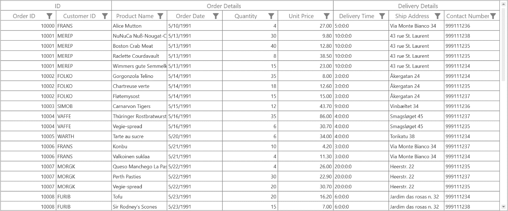

# How to Set StackedHeaders When AutoGenerateColumn as True in WPF DataGrid?

This sample illustrates how to set StackedHeaders when AutoGenerateColumn as true in [WPF DataGrid](https://www.syncfusion.com/wpf-controls/datagrid) (SfDataGrid).

By default, you can't add the [StackedHeaderRows](https://help.syncfusion.com/cr/wpf/Syncfusion.UI.Xaml.Grid.StackedHeaderRows.html) in `DataGrid` when generate the column automatically. But you can achieve this by using [AutoGeneratingColumn](https://help.syncfusion.com/cr/wpf/Syncfusion.UI.Xaml.Grid.SfDataGrid.html#Syncfusion_UI_Xaml_Grid_SfDataGrid_AutoGeneratingColumn) event.


```c#
private void Sfgrid_AutoGeneratingColumn(object sender, Syncfusion.UI.Xaml.Grid.AutoGeneratingColumnArgs e)
{
    if (sfgrid.StackedHeaderRows.Count == 0)
    {
        var gridSHRow = new Syncfusion.UI.Xaml.Grid.StackedHeaderRow();
        gridSHRow.StackedColumns.Add(new Syncfusion.UI.Xaml.Grid.StackedColumn { ChildColumns = "OrderID,CustomerID", HeaderText = "ID" });
        gridSHRow.StackedColumns.Add(new Syncfusion.UI.Xaml.Grid.StackedColumn { ChildColumns = "ProductName,OrderDate,Quantity,UnitPrice", HeaderText = "Order Details" });
        gridSHRow.StackedColumns.Add(new Syncfusion.UI.Xaml.Grid.StackedColumn { ChildColumns = "DeliveryDelay,ShipAddress,ContactNumber", HeaderText = "Delivery Details" });
        sfgrid.StackedHeaderRows.Add(gridSHRow);
    }
}   
```

